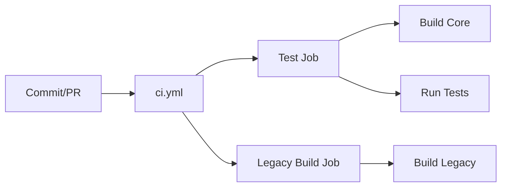
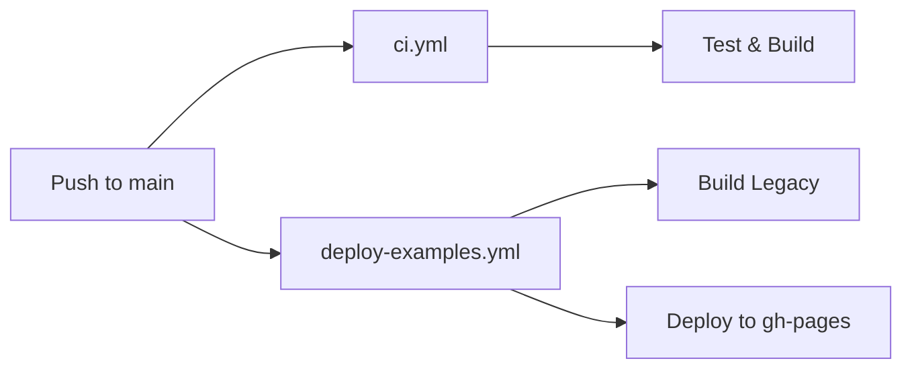

# CI/CD Configuration Update - Phase 1

## Summary

Updated all GitHub Actions workflows to support the new monorepo structure while maintaining backwards compatibility with the legacy build system.

## Changes Made

### 1. ✅ Updated `publishNpm.yml`
**Purpose**: Publish packages to NPM when tags are created

**Key Changes**:
- Switched from `npm` to `pnpm` workspaces
- Updated Node.js version: 20 → 22
- Added pnpm setup with caching
- Now publishes `@tsichart/core` package
- Placeholders for future React/Vue packages
- Uses `pnpm --filter` for selective publishing

**Trigger**: Push to tags matching `v*`

### 2. ✅ Updated `deploy-examples.yml`
**Purpose**: Deploy examples and documentation to GitHub Pages

**Key Changes**:
- Switched from `npm` to `pnpm` workspaces
- Updated Node.js version: 18 → 22
- Added pnpm setup with caching
- Uses `npm run legacy:build` to build examples
- Added `packages/**` to watch paths

**Trigger**: Push to `main` branch or manual dispatch

### 3. ✅ Created `ci.yml` (NEW)
**Purpose**: Run tests and builds on all commits/PRs

**Features**:
- **Two parallel jobs**:
  1. `test` - Build new monorepo packages
  2. `legacy-build` - Verify legacy build still works
  
- **Automated checks**:
  - Install dependencies with pnpm
  - Lint code (when available)
  - Build all packages
  - Run tests (when available)
  - Verify build artifacts exist
  - Upload build artifacts

**Triggers**: 
- Push to `main`, `refactor/**`, `feature/**` branches
- Pull requests to `main`

## Workflow Files

```
.github/workflows/
├── ci.yml                  # NEW: Test and build on every commit
├── publishNpm.yml          # UPDATED: Publish to NPM (monorepo)
└── deploy-examples.yml     # UPDATED: Deploy examples (monorepo)
```

## CI/CD Flow

### On Every Commit/PR:


### On Tag Push (v*):


### On Main Branch Push:


## Key Features

### ✅ Backwards Compatibility
- Legacy build system still works
- Examples deployment unchanged
- No breaking changes for existing users

### ✅ Monorepo Support
- Uses pnpm workspaces
- Selective package building/publishing
- Workspace dependency linking

### ✅ Performance
- pnpm caching for faster installs
- Parallel job execution
- Artifact uploads for debugging

### ✅ Safety
- Frozen lockfile in CI (deterministic builds)
- Build artifact verification
- Both new and legacy builds tested

## Environment Requirements

### GitHub Secrets Needed:
- `NPM_TOKEN` - Required for publishing to NPM

### Repository Permissions:
- `id-token: write` - For NPM provenance
- `contents: read` - For checkout
- `contents: write` - For gh-pages deployment

## Testing Locally

### Test CI Build:
```bash
# Simulate CI environment
pnpm install --frozen-lockfile
pnpm build:core
pnpm build

# Verify artifacts
ls -la packages/core/dist/
```

### Test Legacy Build:
```bash
npm run legacy:build

# Verify artifacts
ls -la dist/
ls -la tsiclient.js tsiclient.css
```

### Test Publishing (dry-run):
```bash
cd packages/core
pnpm publish --dry-run --no-git-checks
```

## Workflow Status

| Workflow | Status | Purpose |
|----------|--------|---------|
| ci.yml | ✅ New | Test & build on every commit |
| publishNpm.yml | ✅ Updated | Publish packages to NPM |
| deploy-examples.yml | ✅ Updated | Deploy examples to GitHub Pages |

## Next Steps

1. **Merge Phase 1** - These workflows will start running
2. **Monitor CI** - Check that builds pass
3. **Add Tests** - Phase 2 will enable test coverage
4. **Update Badges** - Add CI badge to README

## Breaking Changes

### None! 
All workflows are backwards compatible. The legacy build system continues to work alongside the new monorepo structure.

## Migration Notes

### When Ready to Deprecate Legacy:
1. Remove `legacy:build` commands
2. Update `deploy-examples.yml` to use `pnpm build:core`
3. Remove root-level build artifacts
4. Update documentation

### When React/Vue Packages Ready:
Uncomment the publish steps in `publishNpm.yml`:
```yaml
- name: Publish React package
  run: pnpm --filter @tsichart/react publish --provenance --access public --no-git-checks
  env:
    NODE_AUTH_TOKEN: ${{ secrets.NPM_TOKEN }}
```

---

**Status**: ✅ CI/CD Updated and Verified

**All workflows are backwards compatible and ready for use!**
